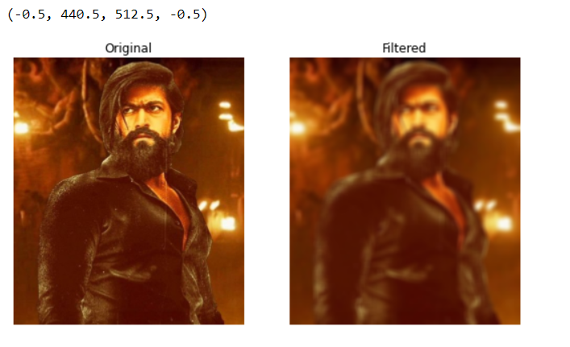
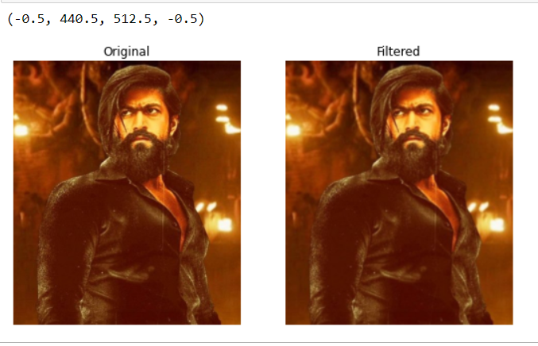
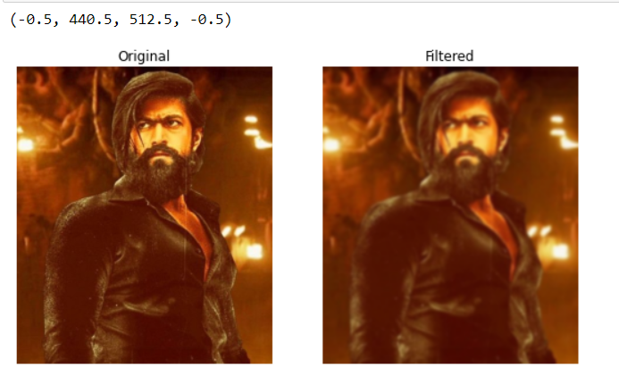
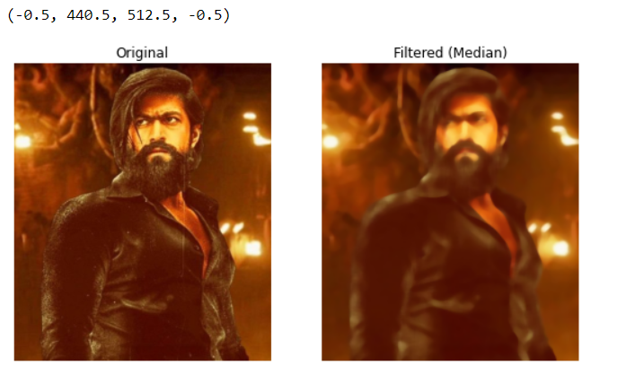
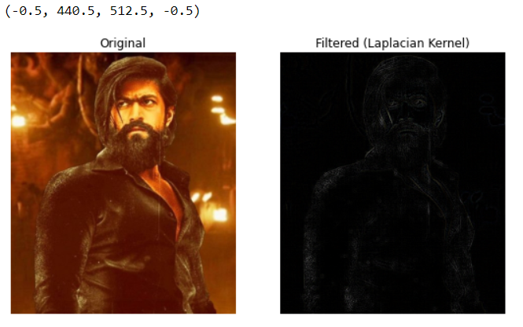
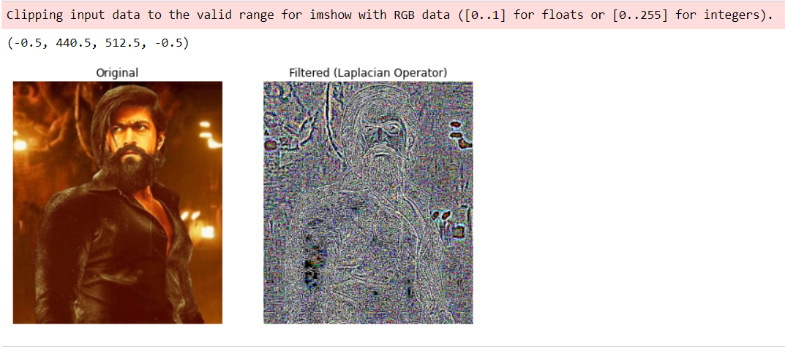

# Implementation-of-Filters
## Aim:
To implement filters for smoothing and sharpening the images in the spatial domain.

## Software Required:
Anaconda - Python 3.7

## Algorithm:

### Step 1:
Import the necessary modules.

### Step 2:
For performing smoothing operation on a image.

Average filter
kernel=np.ones((11,11),np.float32)/121
image3=cv2.filter2D(image2,-1,kernel)

Weighted average filter
kernel1=np.array([[1,2,1],[2,4,2],[1,2,1]])/16
image3=cv2.filter2D(image2,-1,kernel1)

Gaussian Blur
gaussian_blur=cv2.GaussianBlur(image2,(33,33),0,0)

Median filter
median=cv2.medianBlur(image2,13)

### Step 3:
For performing sharpening on a image.

Laplacian Kernel
kernel2=np.array([[-1,-1,-1],[2,-2,1],[2,1,-1]])
image3=cv2.filter2D(image2,-1,kernel2)

Laplacian Operator
laplacian=cv2.Laplacian(image2,cv2.CV_64F)

### Step 4:
Display all the images with their respective filters.

## Program:
### Developed By   :Bharath.V
### Register Number:212221230013
</br>

import cv2
import numpy as np
import matplotlib.pyplot as plt
image = cv2.imread("abcd.jpg")
original_image = cv2.cvtColor(image,cv2.COLOR_BGR2RGB)

### 1. Smoothing Filters

i) Using Averaging Filter
```Python

kernel1 = np.ones((11,11),np.float32)/121
avg_filter = cv2.filter2D(original_image,-1,kernel1)
plt.figure(figsize = (9,9))
plt.subplot(1,2,1)
plt.imshow(original_image)
plt.title("Original")
plt.axis("off")
plt.subplot(1,2,2)
plt.imshow(avg_filter)
plt.title("Filtered")
plt.axis("off")

```
ii) Using Weighted Averaging Filter
```Python

kernel2 = np.array([[1,2,1],[2,4,2],[1,2,1]])/16
weighted_filter = cv2.filter2D(original_image,-1,kernel2)
plt.figure(figsize = (9,9))
plt.subplot(1,2,1)
plt.imshow(original_image)
plt.title("Original")
plt.axis("off")
plt.subplot(1,2,2)
plt.imshow(weighted_filter)
plt.title("Filtered")
plt.axis("off")

```
iii) Using Gaussian Filter
```Python

gaussian_blur = cv2.GaussianBlur(src = original_image, ksize = (11,11), sigmaX=0, sigmaY=0)
plt.figure(figsize = (9,9))
plt.subplot(1,2,1)
plt.imshow(original_image)
plt.title("Original")
plt.axis("off")
plt.subplot(1,2,2)
plt.imshow(gaussian_blur)
plt.title("Filtered")
plt.axis("off")

```

iv) Using Median Filter
```Python

median = cv2.medianBlur(src=original_image,ksize = 11)
plt.figure(figsize = (9,9))
plt.subplot(1,2,1)
plt.imshow(original_image)
plt.title("Original")
plt.axis("off")
plt.subplot(1,2,2)
plt.imshow(median)
plt.title("Filtered (Median)")
plt.axis("off")

```

### 2. Sharpening Filters
i) Using Laplacian Kernal
```Python

kernel3 = np.array([[0,1,0],[1,-4,1],[0,1,0]])
laplacian_kernel = cv2.filter2D(original_image,-1,kernel3)
plt.figure(figsize = (9,9))
plt.subplot(1,2,1)
plt.imshow(original_image)
plt.title("Original")
plt.axis("off")
plt.subplot(1,2,2)
plt.imshow(laplacian_kernel)
plt.title("Filtered (Laplacian Kernel)")
plt.axis("off")

```
ii) Using Laplacian Operator
```Python

laplacian_operator = cv2.Laplacian(original_image,cv2.CV_64F)
plt.figure(figsize = (9,9))
plt.subplot(1,2,1)
plt.imshow(original_image)
plt.title("Original")
plt.axis("off")
plt.subplot(1,2,2)
plt.imshow(laplacian_operator)
plt.title("Filtered (Laplacian Operator)")
plt.axis("off")


```

## OUTPUT:
### 1. Smoothing Filters
</br>

i) Using Averaging Filter



ii) Using Weighted Averaging Filter



iii) Using Weighted Averaging Filter



iv) Using Median Filter



### 2. Sharpening Filters
</br>

i) Using Laplacian Kernal


ii) Using Laplacian Operator


## Result:
Thus the filters are designed for smoothing and sharpening the images in the spatial domain.
